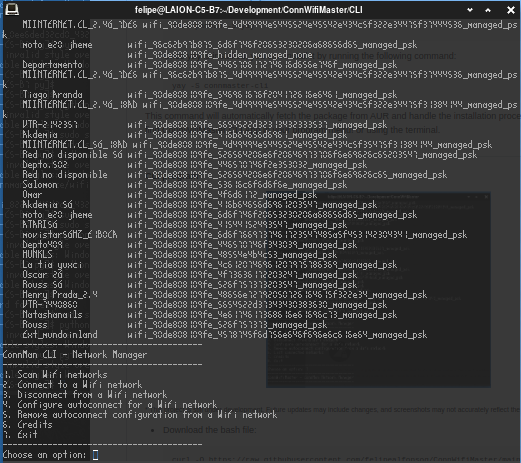
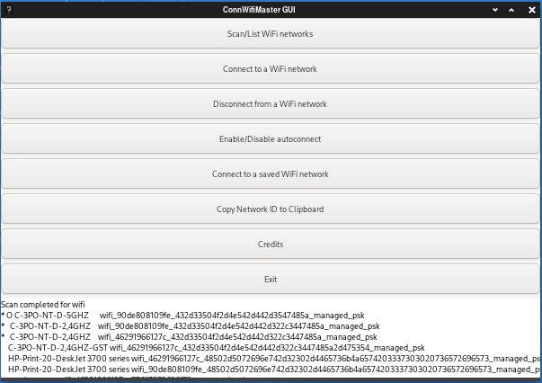

### ConnWifiMaster (GUI & CLI)

<p align="left">
  
</p>

ConnWifiMaster is a GUI & CLI application designed for Arch Linux systems that use ConnMan for network management. This tool provides a user-friendly interface to efficiently handle WiFi connections. It features:

Network Management: View and manage all saved WiFi connections.
Auto-Connect Configuration: Select which networks should connect automatically using checkboxes.
Password Handling: Prompt users to enter passwords when connecting to new networks.
Connection Control: Easily connect to or disconnect from available networks.
And many more options! 

<!-- 
**ConnWifiMaster is designed to use ConnMan as the default daemon for managing and scanning WiFi networks. However, if ConnMan is not running, the program will check for networks using NetworkManager if that daemon is active.**
**Additionally, ConnWifiMaster supports macOS, allowing you to manage and scan WiFi networks on Apple devices as well.**
-->

> [!WARNING]
> This project is a dynamic work in progress. Version 1.0.0, the inaugural stable and fully-featured release, 
> is on the horizon. While it's not yet recommended for daily use due to potential minor inconveniences,
> we welcome enthusiasts to help uncover and resolve bugs or propose exciting new features. But if you wanna try, you are more than welcome!

[](#)
[](#)
[](https://github.com/Naereen/badges/)

[](https://opensource.org/licenses/BSD-3-Clause)
<!--
[](http://perso.crans.org/besson/LICENSE.html)
-->


[](https://www.vim.org/)
[](https://code.visualstudio.com/)


[](https://www.gnu.org/software/bash/)
[](https://www.python.org/downloads/release/python-311/)

<sub>* This is currently an experimental phase where the primary focus is on making the system functional and establishing a practical and logical pathway that aligns with both my vision and the project's goals. It might contain errors, bugs, etc. Many other non-core elements of the project are considered secondary. Project in progress.</sub>

#

#### Installation (CLI version for Arch Linux)*
#### Via AUR using YAY

[](https://aur.archlinux.org/packages/connmaster-cli)

<!-- 
[](https://aur.archlinux.org/packages/connmaster-cli)
-->

<!-- 
https://aur.archlinux.org/packages/connmaster-cli
-->

ConnWifiMaster CLI (connmaster-cli on AUR) is available on AUR (Arch User Repository), and it can be installed using the `yay` package manager. Follow the steps below to install:

1. Make sure you have `yay` installed. If not, you can install it with the following command:
   
   ```
   sudo pacman -S yay
   ```
   Once yay is installed, you can install it by running the following command:
   
   ```
   yay -S connmaster-cli
   ```
This command will automatically fetch the package from AUR and handle the installation process for you.
You can find ConnWifiMaster CLI App in your program menu! or using the terminal.


#

#### CLI program*

<p align="center">
  
</p>

<sub>* This project is still under development. Future updates may include changes, and screenshots may not accurately reflect the final design.</sub>


- Download the bash file:

   ```
   curl -O https://raw.githubusercontent.com/felipealfonsog/ConnWifiMaster/main/CLI/Connmaster-CLI.sh
   ```

   If you want to use -wget- just copy/paste this line:

   ```
   wget https://github.com/felipealfonsog/ConnWifiMaster/raw/main/CLI/Connmaster-CLI.sh
   ```

- Execute it:

   ```
   chmod +x Connmaster-CLI.sh
   ```
   
   ```
   ./Connmaster-CLI.sh
   ```


#

#### Feature Summary
Display all saved WiFi connections: The application lists all available and saved connections.
Select connections for auto-connect: Using checkboxes, you can mark networks to connect automatically.
Enter passwords for new networks: When attempting to connect to a network that requires a password, the app prompts you to enter the password.
Connect and disconnect networks: Options to connect or disconnect from available networks.

#### Additional Notes
Auto-connect: connmanctl manages auto-connect configuration based on the network's service_id.
Passwords: The user interface prompts for a password if required when connecting to a network.

#### Compile in C

```
gcc `pkg-config --cflags gtk+-3.0` -o connwifimaster src/main.c src/connman.c `pkg-config --libs gtk+-3.0`
```

- Explanation:

```
pkg-config --cflags gtk+-3.0: Retrieves the compiler flags for GTK+ 3.
-o connwifimaster: Specifies the output executable name.
src/main.c src/connman.c: Specifies the source files.
pkg-config --libs gtk+-3.0: Retrieves the linker flags for GTK+ 3.
This command compiles main.c and connman.c from the src directory and links them with GTK+ 3 to produce the executable connwifimaster.
```

#### Dependencies 

```
sudo pacman -S gtk3 connman
```

```
sudo pacman -S python-pyqt5 python connman
```


#

#### Screenshots*

[](#)

<!-- 
#### Screenshot macOS

<p align="center">
  
</p>
-->
#### Screenshot Linux (Arch) - C Version 

<p align="center">
  
</p>

#### Screenshot Linux (Arch) - Python Version

<p align="center">
  
</p>

<sub>* This project is still under development. Future updates may include changes to the GUI, and screenshots may not accurately reflect the final design.</sub>
#

#### Installation (Special version for Arch Linux)*
#### Via AUR using YAY

[](https://aur.archlinux.org/packages/connmaster)

<!-- 
[](https://aur.archlinux.org/packages/connmaster)
-->

<!-- 
https://aur.archlinux.org/packages/connmaster
-->

ConnWifiMaster (connmaster on AUR) is available on AUR (Arch User Repository), and it can be installed using the `yay` package manager. Follow the steps below to install:

1. Make sure you have `yay` installed. If not, you can install it with the following command:
   
   ```
   sudo pacman -S yay
   ```
   Once yay is installed, you can install it by running the following command:
   
   ```
   yay -S connmaster
   ```
This command will automatically fetch the package from AUR and handle the installation process for you.
You can find ConnWifiMaster App in your program menu!


#


#### Installation (Python/PyQT5 version for Arch Linux)*
#### Via AUR using YAY

[](https://aur.archlinux.org/packages/connmaster-py)

<!-- 
[](https://aur.archlinux.org/packages/connmaster-py)
-->

<!-- 
https://aur.archlinux.org/packages/connmaster-py
-->

ConnWifiMaster Python/PyQT5 (connmaster on AUR) is available on AUR (Arch User Repository), and it can be installed using the `yay` package manager. Follow the steps below to install:

1. Make sure you have `yay` installed. If not, you can install it with the following command:
   
   ```
   sudo pacman -S yay
   ```
   Once yay is installed, you can install it by running the following command:
   
   ```
   yay -S connmaster-py
   ```
This command will automatically fetch the package from AUR and handle the installation process for you.
You can find ConnWifiMaster App in your program menu!


#


#### Bash Installer 🚀 

[](#)

#### To Install it: 
To install ConnWifiMaster, simply run the installer script available [here](https://github.com/felipealfonsog/ConnWifiMaster/raw/main/installer.sh).

Or just Copy - Paste in your terminal and use -curl- to start downloading the installer:

   ```
   curl -O https://raw.githubusercontent.com/felipealfonsog/ConnWifiMaster/main/installer.sh
   ```


If you want to use -wget- just copy/paste this line:

   ```
   wget https://github.com/felipealfonsog/ConnWifiMaster/raw/main/installer.sh
   ```


#### Important note when installing:

If you encounter issues executing the file in the terminal, like this message "-bash: ./installer.sh: Permission denied", follow these simple steps to fix it:

1. Open your terminal.
2. Navigate to the directory where the installer script is located using the `cd` command.
3. Run the following command to grant execute permission to the installer script:

   ```
   chmod +x installer.sh
   ```
   
4. Now you can run the installer without any problems.

   ```
   ./installer.sh
   ```
   NOTE: The script will ask for -sudo permissions-. Just simply type the -sudo- password.

Now type 'connmaster' in the terminal and enjoy using ConnWifiMaster! 😊🚀

Feel free to reach out if you need any further assistance!

#### Updating with the script: 
If you want to update GitSyncMaster (gitsync) in your system, re-run the script:

   ```
   ./installer.sh
   ```
Please note that if you encounter any issues or have suggestions, feel free to raise an issue on the [ConnWifiMaster repository](https://github.com/felipealfonsog/ConnWifiMaster/issues). Your feedback is invaluable!

Thank you for joining me on this journey, and I hope GitSyncMasters brings value to your life and workflow. Let's continue making technology accessible and enjoyable for everyone!

#


#### 🤝 Support and Contributions

If you find this project helpful and would like to support its development, there are several ways you can contribute:

- **Code Contributions**: If you're a developer, you can contribute by submitting pull requests with bug fixes (ONLY USE THE DEVELOPMENT BRANCH), new features, or improvements. Feel free to fork the project and create your own branch to work on.
- **Bug Reports and Feedback**: If you encounter any issues or have suggestions for improvement, please open an issue on the project's GitHub repository. Your feedback is valuable in making the project better.
- **Documentation**: Improving the documentation is always appreciated. If you find any gaps or have suggestions to enhance the project's documentation, please let me know.

[](https://www.buymeacoffee.com/felipealfonsog)
[](https://www.paypal.me/felipealfonsog)
[](https://github.com/sponsors/felipealfonsog)

Your support and contributions are greatly appreciated! Thank you for your help in making this project better.


#### 📝Important

[](#)


**This project is -for now- an experimental endeavor. Its usage is at your sole discretion and risk. It is provided without any warranty, express or implied. The developers shall not be liable for any damages arising from the use of this software.**


#### License:

This project is licensed under the BSD 3-Clause License. For more information, please see the [LICENSE](LICENSE) file.

